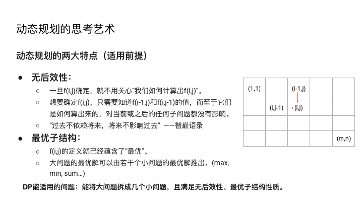

# Dynamic-Programming

**DP套路总结**  

* DP套路\(I\): 第I类基本型（“时间序列”型）
* DP套路\(II\): 第II类基本型（“时间序列”加强版）
* DP套路\(III\): 双序列型
* DP套路\(IV\): 第I类区间型DP
* DP套路\(V\): 第II类区间型DP
* DP套路\(VI\): 背包入门
* DP状态压缩

**DP套路\(III\): 双序列型**

给出两个序列s和t（数组/字符串），让你对它们搞事情。

* Longest Common Subsequences 
* Shortest Common Supersequence
* Edit distances
* ...

套路：

* 定义dp\[i\]\[j\]：表示针对s\[1:i\]和t\[1:j\]的子问题的求解。
* 千方百计将dp\[i\]\[j\]往之前的状态去转移：dp\[i-1\]\[j\], dp\[i\]\[j-1\], dp\[i-1\]\[j-1\]
* 最终的结果是dp\[m\]\[n\]\

